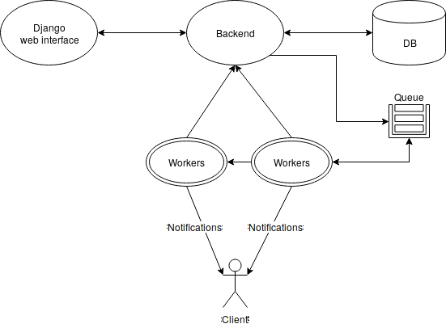

# ES2-2018-LEI-PL-81

## Team

- 73640 - LIGE-PL - Maria Canedo (Developer, QA) - [mjtco@iscte-iul.pt](mjtco@iscte-iul.pt)
- 65175 - LEI-PL - Mauro Pinto (Scrum Master, Lead) - [msbsp@iscte-iul.pt](msbsp@iscte-iul.pt)
- 62189 - LEI-PL - Miguel Amaro (Developer) - [macao1@iscte-iul.pt](macao1@iscte-iul.pt)
- 61161 - LEI-PL - Michael Carvalho (Developer) - [mrmco@iscte-iul.pt](mrmco@iscte-iul.pt)

## [Video](https://www.youtube.com/watch?v=3xksIYommEc)

Notas sobre o vídeo:

No vídeo não é visível a implementação das restrições, porque a nossa implementação presume que estas são implementadas
nos JARs submetidos pelos clientes.

Os clientes podem implementar as restrições fazendo override ao método de geração de soluções `createSolution` ou
implementando a interface `ConstrainedProblem`.

Para a visualização dos emails, estamos a usar um serviço de debugging de emails, [Mailtrap.io](https://mailtrap.io),
evitando assim o envio e uso de contas de emails de produção.

## Arquitectura e Funcionalidades

Todas as funcionalidades foram implementadas. No entanto as funcionalidades foram implementadas de forma diferente do
que especificado, com o consentimento do professor.

### Arquitectura

A nossa arquitectura é constituída por três módulos: Frontend, Backend e Workers.

O Frontend é implementado em Python, sobre a framework Django e é a parte visualizável pelo cliente final. É aqui que
cliente cria as configurações dos problemas e pede a sua execução, bem como visualiza e descarrega as soluções para
os problemas configurados. O Frontend envia e recolhe informação do Backend.

O Backend é implementado em Java, sobre a framework Spring Boot. As suas responsabilidades são a análise do JAR
submetido pelo cliente, guardar e servir as configurações criadas pelo cliente, bem como receber os pedidos de
execução dessas configuração e colocar esses pedidos na fila de tarefas para os workers cosumirem. 

A responsabilidade dos Workers é a execução das tarefas pedidas pelos clientes, a notificação do progresso aos clientes
e o pedido de persistência dos resultados ao Backend. Foi também implementado em Java e Spring Boot.

Os vários módulos são integrados através de web services [REST](https://en.wikipedia.org/wiki/Representational_state_transfer).

### Importação/Implementação do algoritmo do cliente

Ao contrário do especificado no enunciado, tiramos partido das funcionalidades de reflexão do Java para obter as
informações de número de variáveis, número de objectivos e tipo de solução.

Como a aplicação importa o JAR do cliente em runtime, permite que o cliente, para além de defina o seu algoritmo, bem
como as restrições dentro do JAR importado.

A vantagem da importação do JAR em runtime é de uma performance muito superior a soluções que tenham de aceder a
recursos externos, como web services ou iniciar processos no sistema para executar o JAR através do sistema operativo.

### Configurações das aplicações

Para tirar partido do ecosistema das frameworks que utilizámos na implementação do projecto, Django e Spring Boot, não
usámos ficheiros XML para a configuração dos vários módulos, mas ficheiros `.env` e `.properties`, respectivamente.

O ficheiro de configuração `.env` deve estar localizado na pasta `web/frontend`. Um ficheiro exemplo é encontrado aí.

Os ficheiros `application-default.properties` devem ser colocados na mesma localização dos JARs do backend e worker.
Exemplos dos ficheiros podem ser encontrados nas pastas `backend/src/main/resources` e
`optimizationjobrunner/src/main/resources`.

### Fila de tarefas

De forma a permitir o processamento assíncrono, paralelo e distribuído, e constatando que cada tarefa de optimização
ocupa imensos recursos, tirámos partido de filas de tarefas implementadas sobre [RabbitMQ](https://www.rabbitmq.com/).

Assim, é possível que vários servidores corram o módulo de Worker, de forma distribuída e em paralelo, consumindo
tarefas colocadas na fila.

### Persistência de configurações

Em vez de fazer com que o cliente tenha de descarregar cada configuração que tenha feito na aplicação, decidimos
persistir estas configurações numa base de dados relacional [MariaDB](https://mariadb.org/). Julgamos que desta a
aplicação torna-se mais user friendly para os clientes.

### Gráficos

Decidimos usar a biblioteca [Chart.js](https://www.chartjs.org/) em detrimento de [D3.js](https://d3js.org/) sugerida
pela especificação. Tomámos esta decisão, pois, para o tipo de gráficos e funcionalidades desejadas pareceu-nos mais
simples de implementar e usar pelos clientes.

### Interrupções temporais das tarefas

Como especificado, implementámos o tempo limite de execução de cada tarefa. No entanto, cada tarefa é executada na sua
thread e é preciso introduzir pontos que verificam se a thread foi interrompida. O JMetal por defeito não traz nenhuma
forma de verificação de interrupção dos threads, nem o faz sozinho, por isso implementámos a nossa versão do
`ExecuteAlgorithms`, introduzindo pontos de verificação de interrupção. Chamo por isso a vossa atenção para o método run
da classe [OptimizationJobRunnerExecuteAlgorithms](optimizationjobrunner/src/main/java/pt/iscte/es2/optimization_job_runner/jmetal/util/experiment/OptimizationJobRunnerExecuteAlgorithms.java).

### Notificações de progresso para clientes

Visto que a nossa implementação apenas corre o algoritmo fornecido pelo cliente através do JAR carregado para a
aplicação, e visto que a framework JMetal não permite colocar hooks ou subscrever de forma fácil às chamadas do método
`evaluate` de cada problema, implementámos um [decorador](https://en.wikipedia.org/wiki/Decorator_pattern)
sobre os problemas dos clientes, que permite o acoplamento de [subscritores](https://en.wikipedia.org/wiki/Observer_pattern)
de eventos (neste caso o evento de chamada do método `evaluate`.

Assim é possível a qualquer objecto, como o notificador de progresso, ouvir cada `evaluate` e descobrir qual o estado do
progresso relativo à estimativa do total de iterações esperadas.

Assim, chamo a vossa atenção para o package [optimizationjobrunner/src/main/java/pt/iscte/es2/optimization_job_runner/jmetal/problem/observable](optimizationjobrunner/src/main/java/pt/iscte/es2/optimization_job_runner/jmetal/problem/observable)

## Instruções de instalação e execução

### Frontend

0. Requisitos:
    * Python 3
    * SQLite 3
0. Download ou clonar repositório
0. No terminal, deslocar-se para a pasta `web` 
0. Instalar requisitos disponibilizados no ficheiro `requirements.txt` com o comando `pip install -r requirements.txt`
0. Copiar o ficheiro exemplo de configuração `frontend/.env.example` para `frontend/.env` e configurar a gosto
0. Correr as migrações com o comando `python manage.py migrate`
0. Correr a aplicação com o comando `python manage.py runserver` 

### Backend

0. Requisitos:
    * Java 8
0. Descarregar o ficheiro `dist/backend.jar`
0. Copiar o ficheiro de configuração exemplo disponível em `backend/src/main/resources` e configurar a gosto,
colocando o ficheiro na mesma pasta que o jar
0. Correr a aplicação com o comando `java -jar backend.jar`

### Worker

0. Requisitos
    * Java 8
0. Descarregar o ficheiro `dist/worker.jar`
0. Copiar o ficheiro de configuração exemplo disponível em `optimizationjobrunner/src/main/resources` e configurar a
gosto, colocando o ficheiro na mesma pasta que o jar
0. Correr a aplicação com o comando `java -jar worker.jar`
